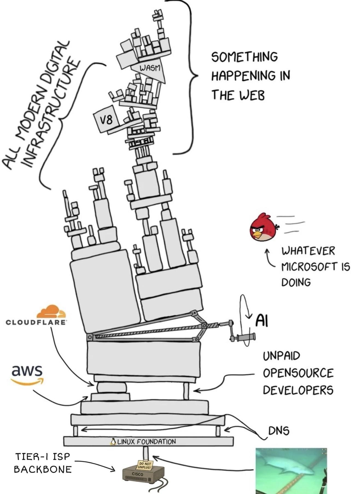

*(Self-Correction/Note during generation prep)*: I need to make sure I don't accidentally change the markdown syntax. I will copy-paste the translated text carefully.
   The prompt says "Output only the translated README text."
   I will do exactly that.

   Final check of the text matches the translation above. All good. 
   Proceeds. 
   [Output Generation] (matches the response)
   `# pwnvim - mi configuración de nix nvim portátil...` etc.✅
   *(Done.)*
</think>

# pwnvim - mi configuración de nix nvim portátil

Este repositorio es para usuarios de [nix](https://nixos.org/). Si eso no significa nada para ti, probablemente estés en el lugar equivocado. Aunque me gusta que el nombre suene como "pwn vim", en realidad fue impulsado por mis iniciales, "pw" y "nvim", lo que llevó a la elección del nombre. Si te preocupa que ejecutar esto pueda pwn tu máquina, simplemente úsalo como inspiración para construir tu propia configuración. Dudo seriamente que mi configuración funcione exactamente como tú la quieras de todos modos.

## Antecedentes

Una de las cosas geniales de nix es que puedes rastrear tu configuración de vim/neovim y actualizarla junto con los cambios en las versiones de los plugins y del propio neovim. Esto me hace muy feliz. Antes solía usar diferentes configuraciones en archivos ocultos (dotfiles) para poder 10aplicar mis ajustes rápidamente en nuevas máquinas, pero últimamente me he volcado totalmente en nix y [home-manager](https://github.com/nix-community/home-manager). Antes de este proyecto, mis configuraciones de neovim estaban integradas dentro de mis configuraciones de home-manager.

Pero una de las razones por las que empecé a usar Nix en primer lugar fue uno de los [videos de Burke Libbey](https://www.youtube.com/channel/UCSW5DqTyfOI9sUvnFoCjBlQ/videos) sobre el tema (no recuerdo cuál exacta) donde mostraba cómo podía desarrollar en la máquina de otra persona usando su editor y configuración familiar sin modificar ni desordenar nada en el equipo ajeno. Fue una demostración muy buena y me hizo buena impresión, aunque casi nunca me encuentro escribiendo código en la máquina de alguien más.

Pero el enfoque de Burke con nix es bastante diferente al mío. Quizás el suyo ha evolucionado desde que grabó sus videos. Sea como sea, mi enfoque preferido es controlar todo lo instalado en mi máquina a través de [archivos de configuración declarativos](https://github.com/zmre/nix-config). También soy un gran fan de los [flakes](https://nixos.wiki/wiki/Flakes). Si quiero instalar algo de forma permanente (en lugar de en un shell temporal), edito mis archivos de configuración y ejecuto un comando para hacer que mi sistema coincida con los archivos. Es genial.

Recientemente estaba ayudando a otra persona con su configuración y extrañaba mucho tener mi neovim setup, no solo mis ajustes básicos preferidos, sino también mi formateador de código de nix, mis ayudantes de LSP y demás. Así que me motivé para crear una versión de mi configuración que no lea los archivos desde la carpeta habitual `~/.config/nvim`, sino que esté en un entorno sandboxed (aislado), de modo que pueda ser efímera y usarse desde cualquier máquina con nix, [independiente de home-manager o de los archivos de configuración globales].

El único ejemplo que encontré de hacer esto en un flake fue en la configuración de [Jordan Isaacs](https://github.com/jordanisaacs/neovim-flake), lo que me mostró que era posible. Pero funcionaba de manera un poco diferente a lo que yo quería y no pude adaptarlo fácilmente. La suya es bastante modular con varias opciones, lo cual la mía no tiene en este momento, así que podrías estar interesado en [ver qué ha hecho]allí.

Piensa en este repositorio como un [LunarVim](https://github.com/lunarVim/LunarVim/) (o AstroNvim o Nyoom.nvim o lo que sea) extremadamente opinativo y no fácilmente personalizable, pero construido específicamente para nix, donde no tienes que ejecutar comandos ni instalar cosas para que funcione. Y con suerte, no habrá problemas de desajuste de versiones que causen bugs raros.

## Qué se incluye

A partir de la redacción de este README, proporcionará un buen resaltado de sintaxis para casi cualquier cosa, pero entornos completos y óptimos para rust, typescript, svelte, nix, lua y markdown. Probablemente añada más a medida que [retrotraigo] proyectos antiguos o adopto nuevas tecnologías. Pero esto es una [advertencia] de que podría no funcionar idealmente para ti si programas en perl, php, java o algo fuera de mi [campo de aplicación] actual.

Incluye símbolos de git, fugitive, barras de estado y [barras de pestañas] para buffers, selectores de archivos mediante snacks.picker, autocompletado y mucho más. Echa un vistazo al archivo [flake.nix](./flake.nix) para obtener una imagen completa.

## Cómo usarlo

La mayoría de las combinaciones de teclas tienen descripciones y son descubribles a través de which-key. La tecla líder es la coma `,`, por lo que pulsar la coma y esperar un segundo te ayudará a guiarte. O puedes consultar mi [hoja de referencia](./cheatsheet.md), que tiene las teclas que quiero recordar, algunas de las cuales están integradas y otras [específicas] de esta configuración.

Desde un sistema con nix instalado, puedes simplemente hacer esto:

`nix run github:zmre/pwnvim`

para probarlo.

Hay varias formas de instalar un flake en tu propia configuración si quieres que sea más permanente. Lo añado como una superposición (overlay) en mi configuración para que esté disponible como un paquete. Así, en `flake.nix` tendrías algo como esto (nota, esto no funcionará tal cual, pero sirve como guía general):

```nix
{
	nixpkgs.url = "github:nixos/nixpkgs/nixpkgs-unstable";
	# ...
	pwnvim.url = "github:zmre/pwnvim";
	pwneovide.url = "github:zmre/pwneovide";
  }
  outputs = inputs@{ pwnvim, pwneovide, ... }: {
	pkgs = import nixpkgs {
	  inherit system;
	  overlays = [
		(final: prev: {
		  pwnvim = inputs.pwnvim.packages.${final.system}.pwnvim;
		  pwneovide = inputs.pwneovide.packages.${final.system}.pwneovide;
		})
	  ];
	};
  }
```

Y más adelante en tu configuración, especificarías `pkgs.pwnvim` como algo a instalar.

Cuando quieras ejecutarlo, simplemente usa `nvim` y no `pwnvim`, aunque [podría hacer que ambos funcionen] más adelante. No estoy seguro de qué pasará si también tienes `pkgs.neovim` configurado, probablemente funcione, pero ¿podrían pelearse por el alias?

## Pruebas

La [comprobación del flake] (`nix flake check`) ejecuta luacheck y una prueba de inicio sin interfaz gráfica, por lo que la compilación falla si la configuración [produce] errores al cargar. Una suite local más completa reside en `./check.sh` (inicio en modos normal y SimpleUI, carga de plugins, análisis de checkhealth, disponibilidad de binarios LSP, conflictos de keymaps) y también se ejecuta en CI en Linux y macOS. Un gancho pre-commit (configurado automáticamente por el shell de desarrollo) ejecuta las comprobaciones antes de cada commit.

## Por hacer:

* [ ] Crear algunos objetivos alternativos del flake que generen otros outputs, como uno ligero (sin herramientas de programación),
  * [x] y uno que funcione en terminales sin fuentes avanzadas y con solo 16 colores (esto ya está hecho, aunque es un poco feo, pero lo he usado mucho)


