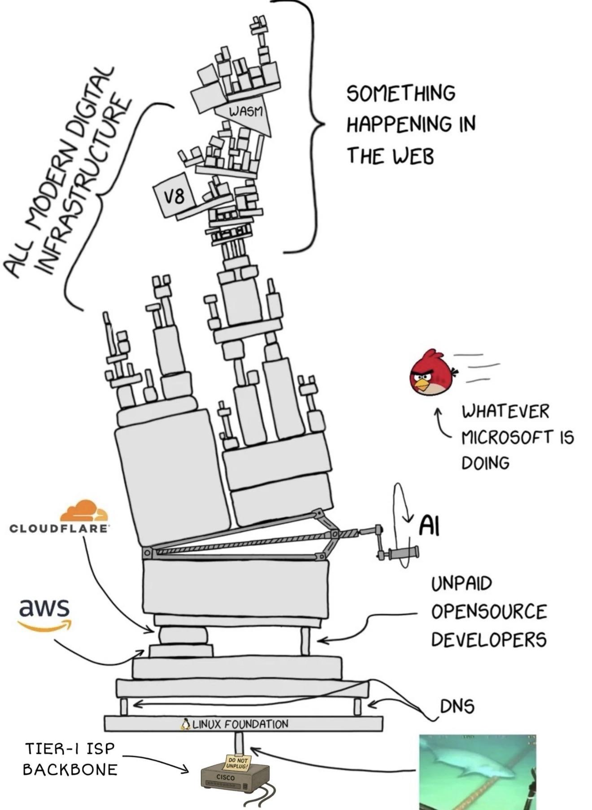

# pwnvim - my portable nix nvim setup

This repo is for [nix](https://nixos.org/) users. If that doesn't mean anything to you, you're probably in the wrong place. Although I rather enjoy the name of this being "pwn vim", it is really my initials, "pw" and "nvim" that drove the name choice. If you're worried that running this will pwn your machine, then you should just use it as inspiration for building your own. I doubt my config will work exactly how you'd like it to anyway.

## Background

One of the awesome thing about nix is that you can track your vim/neovim config and change it along with changes to the versions of plugins and neovim itself. This makes me very happy. I used to use different dot-file configs so I could get my settings onto new machines quickly, but these days I'm all in on nix and [home-manager](https://github.com/nix-community/home-manager). Prior to this project, my neovim configs were embedded in my home-manager configs.

But one of the reasons I started using Nix in the first place was one of [Burke Libbey's videos](https://www.youtube.com/channel/UCSW5DqTyfOI9sUvnFoCjBlQ/videos) on the topic (I forget which one) showing how he could develop on someone else's machine using his familiar editor and settings without modifying or messing up anything on their machine. It was a sweet demo and it made an impression even though I almost never find myself trying to write code on someone else's machine.

But Burke's approach to nix is quite different from mine. Perhaps his has evolved since he made his videos. Regardless, my preferred approach is to drive everything installed on my machine off of [declarative config files](https://github.com/zmre/nix-config). I'm also a huge fan of [flakes](https://nixos.wiki/wiki/Flakes). If I want to install something permanently (as opposed to in a temporary shell), I edit my config files and run a command to make my system match the files.  It's great.

Recently I was helping someone else with their config and I really missed having my neovim setup -- not just my preferred basic settings, but also my nix code formatter and LSP helpers and such. So I was motivated to make a version of my config that didn't read the configs out of the usual `~/.config/neovim` folder, but instead was sandboxed so it could be ephemeral and used from any nix machine independent of home-manager or global config files.

The only example I could find of doing this in a flake was in [Jordan Isaacs](https://github.com/jordanisaacs/neovim-flake) setup, which showed me this would be possible.  But it worked a bit differently than I wanted and I wasn't able to easily adapt it. His is nicely modular with various switches, which mine is not at this point, so you might be interested in checking out what he's done there.

Think of this repo as an extremely opinionated and not readily customizable [LunarVim](https://github.com/lunarVim/LunarVim/) (or AstroNvim or Nyoom.nvim or whatever) but built specifically for nix where you don't have to run commands or install things for it to work. And hopefully there are no version mismatch things causing weird bugs.

## What's Included

As of the writing of this README, it will give nice syntax highlighting to almost anything, but full nice environments for rust, typescript, svelte, nix, lua, and markdown. I will probably add to these as I dust off old projects or pick up new things. But this is sort of a warning that it might not work ideally for you if you're programming in perl, php, java, or something else outside of my present-day wheelhouse. 

It includes git symbols, fugitive, nice status lines and tab bars for buffers, file choosers via snacks.picker, autocomplete, and much more. Take a look at the [flake.nix](./flake.nix) file to get a full picture.

## Using It

Most of the key bindings have descriptions and discoverability via which-key. The leader key is comma so hitting comma and waiting a second will help guide you. Or you can look at my [cheatsheet](./cheatsheet.md) which has keys I want to remember, some of which are built-in and others of which are specific to this config.

From a system with nix installed, you can simply do this:

`nix run github:zmre/pwnvim`

to try it out.

There are a few ways to install a flake in your own config if you want it to be more permanent. I add it as an overlay in my config so it's available as a package. So in `flake.nix` you'd have something like this (note, this won't work as-is, but is meant to be a general guide):

```nix
{
  inputs = {
	nixpkgs.url = "github:nixos/nixpkgs/nixpkgs-unstable";
	# ...
	pwnvim.url = "github:zmre/pwnvim";
	pwneovide.url = "github:zmre/pwneovide";
  }
  outputs = inputs@{ pwnvim, pwneovide, ... }: {
	pkgs = import nixpkgs {
	  inherit system;
	  overlays = [
		(final: prev: {
		  pwnvim = inputs.pwnvim.packages.${final.system}.pwnvim;
		  pwneovide = inputs.pwneovide.packages.${final.system}.pwneovide;
		})
	  ];
	};
  }
}
```

And later in your config you'd specify `pkgs.pwnvim` as something to install.

When you want to run it, just use `nvim` and not `pwnvim` though I may make both work later. I'm not sure what will happen if you also have `pkgs.neovim` setup -- probably works but they'll fight for the alias?

## TODO:

* [ ] Setup some testing so a build fails if there are errors on load or if LSP breaks for some programming language
  * Seriously, if anyone has a good way to test neovim configs especially as part of nix builds, I'd love to hear it
* [ ] Make some alternate flake targets that produce other outputs such as a lightweight one (no programming stuff), 
  * [x] and one that works in terminals without fancy fonts and with only 16 colors (this is now done though it's a bit ugly, but I have used it a lot)




